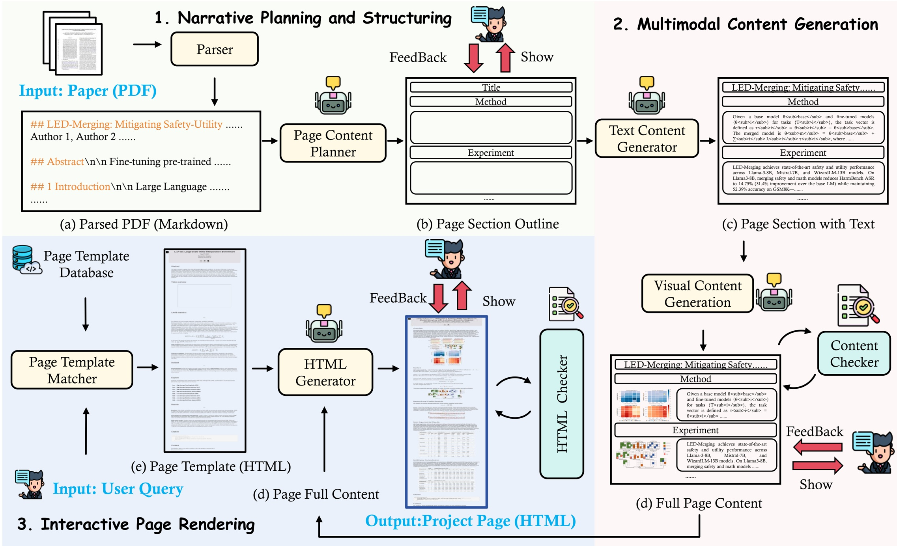
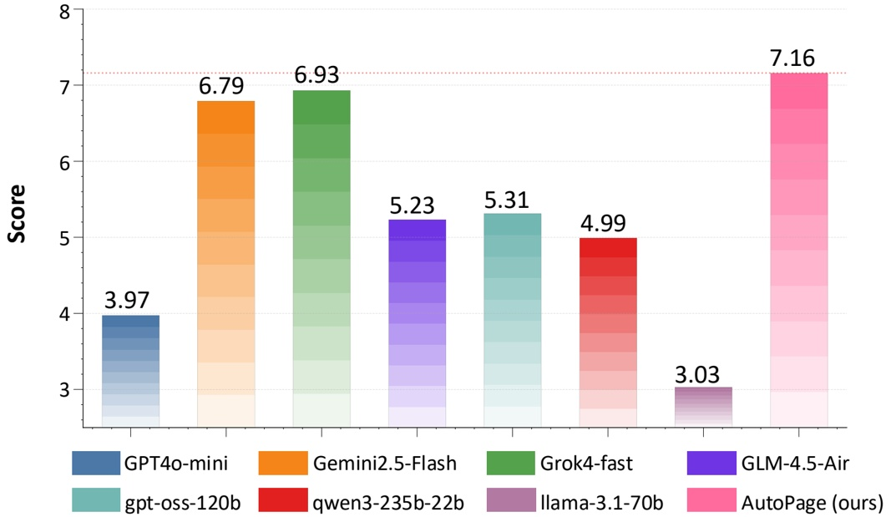
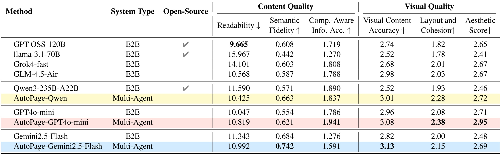

# 📊🤖 Automating Paper-to-Page Crafting with Human-Agent Collaboration ~～

### 🔍 Abstract
The abstract section of this research paper aims to succinctly communicate the core contributions and methodology without delving into specific details or results. The primary focus is on addressing the challenge of automating the creation of dynamic, interactive webpages for scientific papers. Researchers frequently face the laborious task of manually constructing these webpages, which can detract from the core goal of disseminating their findings effectively. While existing tools have automated aspects such as static slides and posters, the complexity of creating interactive webpages remains a significant hurdle.

To tackle this issue, we propose a novel approach through the development of **AutoPage**, a multiagent system designed to streamline the process of converting scientific papers into engaging, interactive web content. AutoPage operates through a hierarchical pipeline that begins with narrative planning, followed by multimodal content generation, and culminates in interactive rendering. This coarse-to-fine approach ensures a systematic and comprehensive transformation of the paper’s content into a user-friendly online format.

A critical aspect of AutoPage is its mechanism for mitigating AI hallucination, a common pitfall in automated systems. The system incorporates dedicated "Checker" agents that verify each step of the process against the original paper, ensuring accuracy. Additionally, optional human checkpoints are provided to further refine the output, guaranteeing that the final product aligns precisely with the authors' intentions. This collaborative framework not only enhances the reliability of the generated webpages but also maintains the integrity and authenticity of the original research.

> Overview of AutoPage. AutoPage conducts a multi-agent pipeline for transforming papers into interactive webpages: (1) Narrative Planning and Structuring parses PDFs into Markdown and generates section-level outlines; (2) Multimodal Content Generation produces coherent text-visual sections; (3) Interactive Page Rendering matches templates, compiles full HTML pages, and performs final layout checks. Throughout all phases, AutoPage integrates verification mechanisms and optional human-in-the-loop checkpoints for reliable and flexible generation.

### 🚀 Motivation
The motivation for this research arises from the limitations of current methods in automating the generation of high-quality project webpages for academic papers. Existing approaches, particularly end-to-end large language models (LLMs) like GPT-4o, face significant challenges in producing both visually appealing and factually accurate webpages. These models are constrained by their rigid, monolithic architecture, which makes them prone to hallucination, leading to unreasonable layouts and a lack of nuanced human oversight necessary for ensuring alignment with the author's vision. Additionally, most existing methods are tailored for static visual formats such as slides, posters, and videos, which fail to capture the dynamic and interactive nature of project webpages. Project webpages require flexible, scrollable structures and interactive elements, making them inherently more difficult to automate effectively.

Addressing these issues is crucial for enhancing the efficiency and effectiveness of scientific communication. Automated generation of project webpages can significantly reduce the time and effort required for authors to create comprehensive and engaging online representations of their work. This, in turn, can lead to better dissemination and understanding of research findings, ultimately contributing to advancements in the field. Furthermore, developing robust automated tools for generating project webpages can set new standards for digital scholarly communication, paving the way for more sophisticated and user-friendly online platforms.

> Overview of our work. (a) End-to-end LLMs directly convert papers into project pages, resulting in unreasonable layouts and lacking human feedback. (b) Our proposed AutoPage integrates human-agent collaboration into automated page generation with higher content and visual quality. The figure also illustrates the process for constructing the PageBench benchmark.

### 💡 Innovation
The main innovations and key contributions of this paper revolve around the development of AutoPage, a multi-agent system designed to automate the generation of high-quality, interactive project webpages from academic papers. Unlike previous approaches that focused on static formats like slides or posters, AutoPage addresses the unique challenges of dynamic, interactive webpages through a hierarchical, coarse-to-fine generation process that integrates iterative human-agent collaboration. This approach ensures both factual accuracy and visual appeal, mitigating the risks of AI hallucination.

AutoPage introduces several advancements over existing methods:
- **Model-Agnostic Adaptability**: AutoPage operates with model-agnostic adaptability, effectively enhancing the performance of various large language models (LLMs) without requiring prompt or configuration adjustments. This feature broadens its applicability across different LLMs, ensuring consistent quality regardless of the underlying model.
- **Narrowing Performance Gap**: It narrows the performance gap between high- and low-capability backbone models, making it a transformative tool rather than merely incremental. This capability is particularly significant as it democratizes access to high-quality webpage generation, reducing reliance on highly specialized or expensive models.
- **Iterative Human-Agent Collaboration**: The integration of iterative human-agent collaboration ensures that the generated webpages are not only technically accurate but also visually appealing and user-friendly. This collaborative approach enhances the final product’s quality and relevance, addressing the limitations of purely automated systems.

These innovations collectively represent a substantial step forward in the field of automated webpage generation, offering a robust solution for creating engaging and informative project webpages from academic papers.

> Qualitative comparison illustrating AutoPage's superior generation quality over baselines. The figure highlights four common scenarios where AutoPage demonstrates superior performance: (a) Formula Presentation; (b) Image Layout; (c) Table Presentation; (d) Content Planning. This qualitative comparison demonstrates AutoPage's ability not just to fill a page with content, but to thoughtfully design it.

### 🛠️ Methodology
The methodology section of this research paper outlines the systematic approach used to develop and implement AutoPage, a multi-agent system designed to automate the generation of high-quality, interactive project webpages from academic papers. The process begins with the *Paper Content Parser*, which utilizes tools such as MinerU and Docling to convert the source PDF into a structured narrative blueprint. This module extracts both text-based and visual elements, creating a clean, JSON-like asset library that serves as the foundation for subsequent stages.

Following the parsing phase, the *Page Content Planner* takes over, leveraging the structured asset library to architect the webpage’s high-level structure. This module optimizes the narrative flow for web presentation, ensuring that the content is presented in a manner that enhances readability and engagement for the target audience.

The *Page Template Matcher* plays a crucial role in selecting an appropriate template from a curated library, guided by user-specified stylistic preferences. This ensures that the generated webpage aligns with the paper’s content and meets aesthetic requirements. The selected template is then seamlessly integrated with the content modules by the *HTML Generator*, which produces the final web artifacts.

This multi-agent system approach allows for a modular and flexible design, enabling each component to specialize in its respective task while maintaining seamless integration. The use of structured data and automated tools ensures consistency and efficiency in the generation process, thereby reducing the manual effort required for creating high-quality project webpages.

> Human preference study. The bar chart shows that AutoPage attains the highest user preference score, surpassing all baselines with more informative, coherent, and visually engaging webpages.

### 📊 Experiments
The experiments section of this research paper evaluates the effectiveness of the proposed AutoPage system through rigorous benchmarking against a range of advanced language models. These models were selected to represent both closed-source and open-source alternatives, ensuring a comprehensive comparison.

- **User Study**: A user study involving 20 participants was conducted to assess the perceived quality of the webpages generated by AutoPage. Participants rated the webpages on a scale from 1 to 10, with AutoPage achieving an average score of 7.16, significantly higher than Grok4-fast (6.93) and Gemini2.5-Flash (6.79). This result underscores AutoPage’s ability to generate not only informative but also visually appealing and user-friendly webpages.

- **Main Results**: Quantitative evaluations revealed that AutoPage substantially enhanced the performance of existing end-to-end methods across several key metrics. Specifically, when paired with GPT4o-mini, AutoPage improved the Aesthetic Score from 2.71 to 2.95 and the Visual Content Accuracy from 1.276 to 1.941. Additionally, AutoPage demonstrated superior layout and cohesion, as well as higher semantic fidelity compared to other models. These improvements indicate that AutoPage effectively integrates and enhances the capabilities of underlying language models, resulting in more coherent and visually pleasing webpages.

- **Comparative Analysis**: The experiments also included direct comparisons between AutoPage and individual components of the system, such as the multi-agent architecture and the interaction protocols. These analyses highlighted the synergistic benefits of the multi-agent design, which allowed for more dynamic and context-aware content generation.

Overall, these experiments provide strong evidence of AutoPage’s capability to automate the creation of high-quality, interactive project webpages, thereby addressing the limitations of current methods and demonstrating significant advancements in the field.

> Main evaluation results across our full suite of PageBench. The best performance among all methods for each metric is in bold , and the second best is underlined. For ease of comparison, AutoPage and its corresponding proprietary base models are highlighted in matching colors. AutoPage improves both content and visual quality over different base models, validating its effectiveness in producing accurate, coherent, and visually refined webpages.

